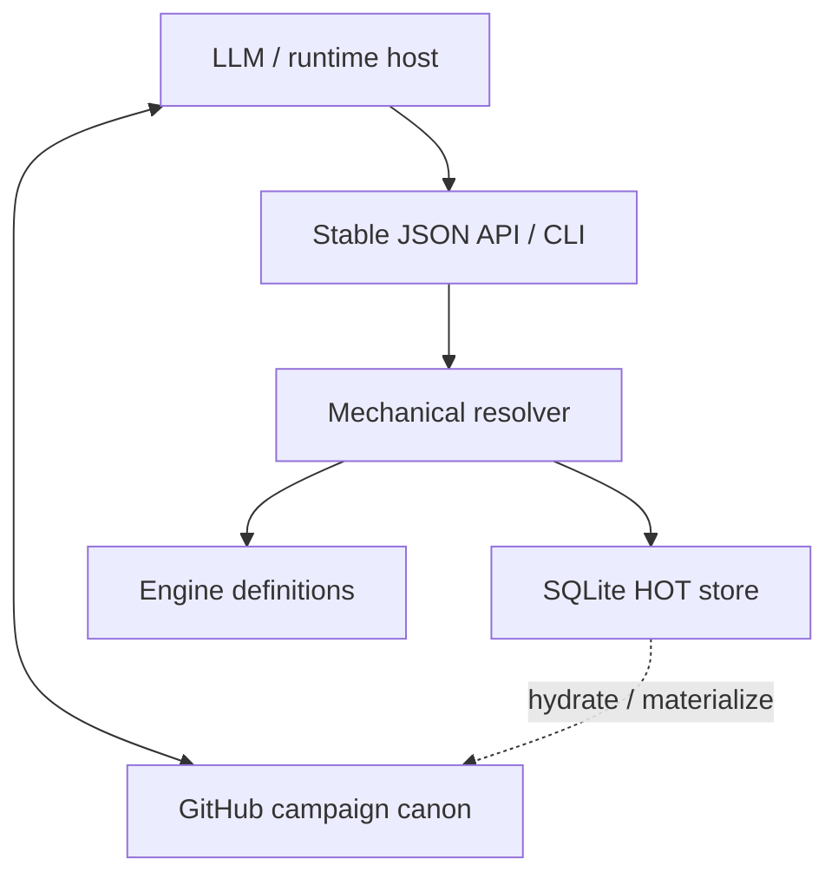
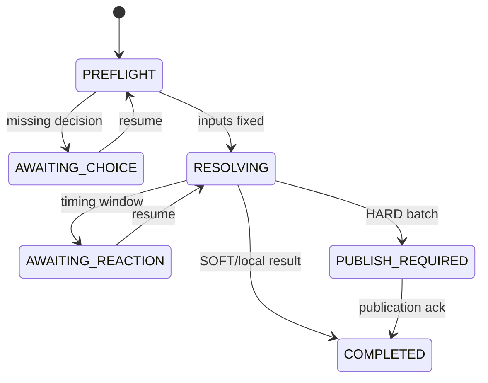

# Mechanical Runtime and Physical Hot State — Architecture Proposal

Status: **PROPOSAL / Phase C**

Implementation status: **not started**

Target baseline: D&D Master engine `0.7`, D&D 2024 / SRD 5.2.1

Target branch: `feature/mechanical-runtime-hot-state`

This document proposes the smallest general architecture that turns the current
conceptual hot working set into a physical mechanical runtime. It is a review
document, not an implementation contract yet. Existing CORE contracts remain
authoritative until Phase E deliberately updates them.

## 1. Decision summary

1. GitHub campaign data remains durable canon. SQLite is a disposable local
   projection and transaction store.
2. A new runtime session can reconstruct the complete **canonical** mechanical
   state at a pinned durable frontier. Byte-for-byte SQLite recovery is neither
   required nor desirable.
3. Incidental non-canonical entities may be lost with the local environment.
   A canonical record may never depend on such an entity; dependency promotes
   it before publication.
4. The LLM maps natural-language intent to a typed `RuntimeCommand`. Mechanical
   intent becomes an `ActionRequest`; an already-adjudicated deterministic world
   change becomes a bounded `DomainTransitionRequest`. The LLM does not
   calculate authoritative mechanics or submit arbitrary record patches.
5. An `Activity` is a declarative, bounded state machine. A `Resolution` is one
   invocation of an Activity.
6. `RuleElement` instances contribute typed modifiers to transient mechanical
   signals. They do not execute arbitrary code or mutate state directly.
7. A bounded `TriggerBinding` may offer a reaction on a pre-commit Signal or
   schedule a child Activity from a committed Event. It is not a generic event
   bus and cannot rewrite an already committed fact.
8. A transient signal is not an event. A `MechanicalEvent` exists only after an
   atomic resolution segment commits, including consequential no-delta results
   such as a miss or successful save.
9. Dialogue supplies the control loop. Reactions and choices suspend a
   Resolution as `AWAITING_CHOICE`; no real-time event loop, timer, or daemon is
   required.
10. SQLite transactions never remain open across ChatGPT turns. A suspended
   Resolution stores its continuation, fixed rolls, and expected revisions.
11. Dice are behind a `DiceEngine` adapter. Avrae's MIT-licensed `d20` engine is
    the preferred implementation candidate; a local adapter or maintained fork
    may restrict syntax and control RNG.
12. Durable priority and publication status are separate. `SOFT` can accumulate;
    `HARD` requires a GitHub publication barrier. A published batch may include
    both HARD events and their causally required earlier SOFT state.
13. Contracts, currency/asset transfers, artifacts, focal-location changes,
    companion or critical-NPC changes, mission-critical transitions, and other
    configured high-impact events become immediate HARD boundaries.
14. This last decision intentionally changes the current
    `CORE/DURABILITY_GUARD.md` policy and therefore requires an explicit CORE
    update in Phase E.

### 1.1 Error classes addressed by the architecture

| Mechanism | Concrete failure it prevents or contains |
|---|---|
| Typed Activity/transition union | LLM-shaped ad-hoc mechanics and arbitrary record patches |
| Signal/Event boundary | Damage/effects becoming state before reactions and validation finish |
| Pure RuleElement Contributions | Hidden mutation, recursive rule execution, untraceable bonuses |
| Pre/post TriggerBinding split | A follow-up rewriting an already committed fact |
| SQLite event-batch transaction | Partial HP/resource/effect updates |
| Revision + idempotency keys | Duplicate tool retries and stale-state application |
| Publication closure | Git commit containing an item transfer without its entity/index/state dependencies |
| Canonicality promotion guard | Durable records pointing to lost incidental entities |
| Typed suspension/failure | Narration filling missing mechanics with invented values |

## 2. Prior art and what is reused

The proposal is a synthesis of working patterns, not a copy of one engine.

| Source | Pattern adopted | Pattern not imported |
|---|---|---|
| [Avrae Automation](https://avrae.readthedocs.io/en/latest/automation_ref.html) | Typed mechanical nodes, hit/miss and save branches, prior-step values, structured results | Recursive automation trees, Avrae command/runtime surface, and unrestricted expression environment |
| [Avrae d20](https://github.com/avrae/d20) | Dice grammar, result AST, keep/drop/reroll/min/max, execution limits | Global RNG ownership and direct execution of arbitrary LLM-provided strings |
| [Foundry D&D5e Activities](https://github.com/foundryvtt/dnd5e/wiki/Activities) | Actor/Item/Activity split, activation, target, consumption, uses, effects, multiple activities per item | Foundry documents, hooks, UI, canvas, and module lifecycle |
| [PF2e Rule Elements](https://github.com/foundryvtt/pf2e/wiki/Quickstart-guide-for-rule-elements) | Selector, predicate, modifier provenance, typed stacking | PF2e's complete actor-preparation pipeline and large rule-element catalogue |

The following parts are specific to D&D Master:

- GitHub campaign tree as durable canon;
- SQLite as a disposable physical HOT projection;
- hydration and publication requests executed by the host through the GitHub
  connector;
- SOFT/HARD durability integration;
- dialogue-driven continuations instead of a real-time game loop;
- strict typed failure and no ad-hoc Python/SQL during gameplay.

Any source code incorporated later must receive a separate license and
maintenance review. Architectural ideas alone do not imply code copying.

## 3. Vocabulary and boundaries

| Term | Meaning | Durable by itself? |
|---|---|---:|
| `Intent` | Player meaning inferred by the LLM | No |
| `RuntimeCommand` | Tagged request envelope accepted by the HOT runtime | No |
| `ActionRequest` | Typed request sent to the runtime | No |
| `DomainTransitionRequest` | Typed deterministic canonical-state transition | No |
| `Activity` | Reusable definition of a supported action | Its canonical definition may be |
| `Resolution` | One execution instance of an Activity | Pending state is operational |
| `ResolutionChain` | Root Resolution plus causally triggered child Resolutions | Operational; its committed Events follow policy |
| `Step` | Typed unit inside an Activity | No |
| `Signal` | Transient calculation/timing input exposed to Rule Elements | No |
| `Contribution` | Typed modifier returned by a Rule Element | No |
| `TriggerBinding` | Embedded bounded mapping from a registered Signal/Event to a reaction or follow-up Activity | No; its owner may be canonical |
| `StateDelta` | Proposed mutation produced by resolution | No, until committed |
| `MechanicalEvent` | Immutable fact produced by a committed segment | Locally committed; policy decides publication |
| `ResolutionTrace` | Inputs, rolls, modifiers, calculations, rejected contributions and deltas | Normally HOT; selected details may be materialized |
| `SemanticEvent` | Compact campaign-log projection of one or more MechanicalEvents | Yes after Git publication |
| `PublicationBatch` | Coherent set of paths/events promoted to a Git commit | Yes after acknowledgement |

### 3.1 Action boundary

An Action begins when a valid `ActionRequest` is bound to one Activity and a
new `resolution_id` is created. It ends as exactly one of:

- `COMPLETED`;
- `REJECTED` before any irreversible segment;
- `ABORTED` with explicit partial-completion reporting for already committed
  segments; there is no general compensation or rollback language.

`AWAITING_CHOICE`, `AWAITING_REACTION`, `HYDRATION_REQUIRED`, and
`PUBLISH_REQUIRED` suspend the same Action. They do not create another Action.

One player message may contain several intents. The host should create separate
ActionRequests unless the rules define a composite Activity such as Multiattack
or a spell with several targets. This keeps idempotency and action-economy
accounting explicit.

Not every durable consequence is a mechanical Action. When adjudication has
already established a deterministic transition such as signing a contract,
moving to a new focal location, transferring money, or promoting an NPC, the
host submits a `DomainTransitionRequest`. It uses the same revision checks,
atomic event batch, dirty tracking, and durability guard without inventing an
Activity or dice roll.

Domain transitions are a fixed tagged union, not JSON Patch. Expected families
include currency transfer, item transfer/status, location transition, contract
state, companion/mission state, entity promotion, relationship change,
combat/turn/time advancement, and typed factual commitment. A genuinely new
transition kind requires a reviewed schema/runtime primitive.

### 3.2 Signal/event boundary

A Signal describes something that is being calculated or offered, for example:

- `attack.prepare`;
- `attack.roll.ready`;
- `attack.hit.pending`;
- `damage.component.pending`;
- `save.success.pending`.

Rule Elements inspect Signals and return Contributions. Signals can be revised,
rejected, or abandoned without creating history.

A MechanicalEvent is appended only when a complete resolution segment commits.
Examples:

- `resource.consumed`;
- `attack.missed`;
- `damage.applied`;
- `effect.created`;
- `item.transferred`;
- `location.changed`.

This boundary prevents a reaction window from observing damage that has already
been applied and prevents a failed preflight from becoming fictional history.

### 3.3 Event/publication boundary

An Event is not a Git commit. One Action may produce several Events; one Git
commit may publish Events from several Actions. Publication timing is selected
by durability policy, not by event creation.

## 4. Component architecture



The dotted SQLite/GitHub relationship is orchestrated by the host. Gameplay
Python code does not receive repository credentials and does not perform network
I/O.

### 4.1 Runtime packages

Proposed implementation surface:

```text
MECHANICS/
  api.py                 fixed request/response dispatcher
  models.py              tagged unions and validation
  store.py               SQLite transactions and migrations
  activity.py            Activity compilation and execution
  rules.py               selectors, predicates, stacking, contributions
  dice.py                DiceEngine interface and adapter
  resolver.py            Resolution state machine
  events.py              event batches, causation and projections
  hydration.py           typed import/revision checks
  materialize.py         dirty closure and campaign-file projections
  recovery.py            rebuild from canonical campaign inputs
  errors.py              typed failures
TOOLS/
  mechanical_runtime.py  only supported gameplay entry point
```

The names are provisional. Module boundaries are architectural; Phase D should
merge modules when separation does not prevent a concrete error class.

### 4.2 Process model

The first implementation is a short-lived CLI process per tool call:

1. accept one versioned JSON request on stdin;
2. open the session SQLite file;
3. execute one bounded operation;
4. commit or roll back;
5. return one versioned JSON response on stdout;
6. close the process.

No daemon is required. SQLite carries state across calls. A service process may
be considered later only if measured startup cost becomes material.

## 5. State model

### 5.1 Canonical, HOT, and effective state

For any entity:

```text
canonical/base record
  + canonical equipment/features
  + HOT current resources and conditions
  + active EffectInstances
  + matching RuleElement Contributions
  + explicit situational context
  = effective state for one resolution
```

Base and current values remain distinct:

- an AC buff does not rewrite base armor calculation;
- damage changes current HP, not maximum HP;
- temporary maximum HP is an explicit effect/current facet;
- derived attack/save/skill values are caches, never independent canon.

Effective values are keyed by entity revision plus context signature. A change
to an ability, proficiency, item, condition, effect, or relevant rule invalidates
the cache.

### 5.2 Canonicality classes

Runtime entities have an operational persistence class:

| Class | Meaning | Recovery after environment loss |
|---|---|---|
| `CANONICAL` | Backed by a campaign record/path | Reconstructed |
| `PROMOTABLE` | Local entity allowed to become canonical | Lost unless promoted |
| `EPHEMERAL` | Deliberately local/incidental | Lost |

Existing NPC `tier` and runtime canonicality are related but not identical. An
incidental NPC can still be canonical; a mechanically generated combat extra can
remain EPHEMERAL.

Invariant: before a canonical event or record references a PROMOTABLE/EPHEMERAL
entity, the publication closure must either promote it to a minimal canonical
record or reject the publication as `NONCANONICAL_DEPENDENCY`.

## 6. Physical SQLite model

SQLite contains source projections, operational state, and derived indexes. It
is excluded from engine releases, Git, and campaign branches.

Structured JSON files were viable for raw latency in the local probe, but a
single Action commonly changes several actors, resources, effects, events,
traces, dirty markers, and RNG state. SQLite supplies one crash-safe transaction,
rollback, uniqueness constraints, and indexed lookup for that bundle. A JSON
store would require rebuilding those facilities around temp files, locking, and
multi-file recovery. The runtime therefore selects SQLite for operational state
while retaining YAML/JSON campaign records as the durable interchange format.

Minimum logical tables:

| Table | Purpose |
|---|---|
| `runtime_session` | Schema version, engine identity, campaign/ref/frontier, RNG state, health |
| `entities` | Typed entity documents, canonical path/hash, hot/hard revisions, canonicality |
| `activities` | Compiled Activity definitions and their source/entity ownership |
| `rule_elements` | Compiled selectors/predicates/contributions with source provenance |
| `trigger_bindings` | Registered pre-commit reactions and post-commit follow-ups |
| `effects` | Active EffectInstances, duration and source |
| `resolutions` | Active/suspended Resolution state, continuation and compact trace |
| `mechanical_events` | Append-only locally committed events with causation/correlation IDs |
| `dirty_records` | Changed canonical projections, reasons, revisions and dependency edges |
| `publication_batches` | Prepared/acknowledged/blocked batches and published event frontier |

Completed traces may be retained inside `resolutions` for a bounded audit window
and then compacted. Phase D may separate them only if measured access or retention
requires it.

### 6.1 Revision fields

Every canonical HOT record tracks:

- `base_head_sha` and, when known, source blob hash;
- `hard_revision`: last revision acknowledged as Git-published;
- `hot_revision`: current local revision;
- `dirty = hot_revision > hard_revision`;
- the event IDs responsible for the dirty state.

Hydration must never overwrite a dirty record. A newer canonical record triggers
targeted reconciliation or `STALE_HOT_REVISION`.

`state_revision` is the session-wide committed-mutation counter and the initial
cache invalidation token. Every successful mutating SQLite transaction advances
it once, regardless of how many records the transaction changes. Derived cache
entries stamped with an older revision are recomputed. This is intentionally
coarse; it avoids a dependency graph until measured workload requires one.

## 7. Activity representation

Activities are data, validated and compiled at hydration/definition load time.
They can be provided by:

1. standard engine definitions;
2. a canonical item, feature, spell, actor, or effect;
3. campaign-specific data using supported primitives.

The normative data contract is `ACTIVITY_MODEL.md`. The definition envelope owns
identity and localization; invocation context owns source provenance. Activity
data requires only `family_id` and non-empty ordered `steps`. Activation,
requirements, targeting, and Resource-referencing costs are optional. Uses and
recovery belong to Resources; result duration belongs to the created Effect.

Illustrative shape:

```yaml
family_id: activity.attack
activation:
  economy_id: resource.action
  amount: 1
targeting:
  kind_id: target.entity
  minimum: 1
  maximum: 1
  range_mode_id: range.reachable
steps:
  - op: op.resolve_attack
    export: attack
  - op: op.apply_damage
    when:
      result: attack.outcome
      in: [hit, critical]
```

### 7.1 Allowed composition

The first general Activity language permits:

- finite ordered sequences;
- branches on typed prior results;
- bounded iteration over an explicit target list;
- reads from actor, target, context, and prior-step exports;
- limited arithmetic/value transformations;
- fixed state mutation primitives;
- explicit choice/reaction suspension.

It does not permit:

- arbitrary Python, SQL, imports, file/network access, or `eval`;
- arbitrary world queries from inside an Activity;
- unbounded loops or recursion;
- runtime creation of executable rule structures;
- direct GitHub access;
- Rule Elements invoking Activities recursively.

New numbers, predicates, selectors, dice, and combinations remain data. A new
kind of state transition or timing window requires a runtime primitive.

Activities and DomainTransitionRequests meet at the event boundary: both must
produce a validated state-delta plan before the shared store can commit an event
batch. A DomainTransitionRequest normally needs no Signals because its fictional
adjudication has already happened; it still receives revision, authorization,
reference, canonicality, and durability validation.

## 8. Rule Elements and effects

An `EffectInstance` is state: source, target, start/end, duration, stacks, and
attached Rule Elements. A `RuleElement` is a pure conditional contribution and
an embedded value owned by the definition that grants it. The normative
contract is `RULE_ELEMENT_MODEL.md`.

Minimum RuleElement fields:

```yaml
operation_id: rule.add_damage_component
selector: damage.weapon
value:
  dice: 1d6
  damage_type_id: damage.radiant
predicate:
  all:
    - fact: source.equipped
    - fact: target.marked
```

Rule Elements may contribute only a fixed tagged union, initially including:

- flat modifier;
- dice term or damage component;
- advantage/disadvantage state;
- minimum, maximum, replacement, reroll policy;
- resistance, vulnerability, immunity, or damage conversion;
- resource-cost modification;
- target/DC/critical-threshold modification;
- effect duration or stack modification;
- typed usage-gate request.

Owner provenance is derived rather than copied into the element. A registered
selector owns timing, so Rule Elements have no independent `phase`. A limited
element may reference a Resource gate; the resolver, rather than the Rule
Element, applies the usage change atomically. Every accepted and rejected
Contribution retains source and reason in the trace.

### 8.1 Predicates

Predicates are `all` / `any` / `not` trees over explicit runtime facts:

- actor/target tags and conditions;
- source equipped/attuned/identified state;
- action, damage, ability, weapon, spell, and effect selectors;
- range/cover/visibility facts already established by adjudication;
- current turn/round and usage counters;
- typed comparisons against exposed values.

They cannot discover an unstated fictional fact. The LLM/adjudication layer must
first establish facts such as `target_within_5_ft_of_ally` in the typed context.

### 8.2 Trigger bindings and follow-ups

Embedded TriggerBindings cover timing mechanics that are not passive modifiers:

1. A **pre-commit Signal binding** offers a reaction or choice while the current
   outcome can still change. Shield can react to `attack.hit.pending` before
   damage is committed.
2. A **post-commit Event binding** schedules a child Resolution after an
   irreversible fact. Damage applied to a concentrating actor can schedule a
   concentration-save Activity. That child may add later Events but cannot
   remove or rewrite `damage.applied`.

The child receives a new `resolution_id`, the same `chain_id`, and the triggering
Event as `caused_by`. Mandatory children keep the ResolutionChain open even when
the root Activity has completed.

Bindings live on the Feature, Effect, Asset, equipment property,
Feat, or Hazard that grants them. They name a registered Activity and a
registered Signal/Event selector and have no independent canonical ID. They
cannot contain executable callbacks. The runtime enforces deterministic
ordering, a per-binding/per-event idempotency key, one-fire/usage gates, and a
small configured chain-depth limit. Reaching that limit returns
`TRIGGER_DEPTH_EXCEEDED`; it never silently drops or recursively continues.

There is no background event source. Turn advancement, effect ticking, rests,
world-time advancement, and scheduled procedures run only after an explicit
typed RuntimeCommand. Wall-clock time and model context length do not advance
the game.

## 9. Resolution state machine



`REJECTED` and typed failures may exit from PREFLIGHT or RESOLVING before an
unrecoverable result is narrated.

### 9.1 Standard step phases

Each typed step uses the subset of these phases that applies:

1. `prepare`: resolve values, targets, selectors and candidate Rules;
2. `cost`: validate and, when rules require, commit activation costs;
3. `test`: perform attack/check/save and record raw rolls;
4. `determine`: derive hit/miss/success/failure and open applicable reactions;
5. `effect`: calculate and apply damage/healing/effects/resources;
6. `aftermath`: usage counters, durations, cleanup and exported results.

The runtime exposes typed `before`/`after` Signals only at registered phases. It
does not provide a generic callback mechanism.

### 9.2 Dialogue-driven reaction windows

A reaction window contains:

- stable `window_id` and parent `resolution_id`;
- trigger selector and phase;
- eligible actors and Activities;
- facts the responder is entitled to know;
- already fixed rolls/results that must be preserved;
- expected HOT revisions;
- deterministic resume position.

The runtime returns `AWAITING_REACTION`; the host asks the relevant player or
Master and later calls `resume_resolution`. There is no wall-clock timeout. A
window closes only through an explicit response or rules-defined default.

### 9.3 Transaction and suspension boundary

SQLite transactions never span responses. A Resolution is divided into atomic
segments at external choice/reaction boundaries.

- Uncommitted proposed effects remain in the continuation and are not visible as
  state.
- Rolls already made are stored and reused after resume.
- Costs already made irreversible by the rules are committed as their own
  segment and are not silently rolled back when a later reaction cancels the
  primary effect.
- Every committed segment appends its Events, updates projections, trace, dirty
  set, usage counters, and RNG state in one SQLite transaction.
- Resume revalidates the revisions on which the pending segment depends.

Most ordinary attacks have no external pause and commit in one segment. Complex
activities such as spell activation followed by Counterspell may use more than
one segment because the spell slot is consumed even if the effect is later
prevented.

### 9.4 Idempotency

Every `resolve` and `resume` request carries an idempotency key. Repeating the
same key returns the stored result. Reusing a key with different input returns
`IDEMPOTENCY_CONFLICT`. This prevents duplicate damage, resource spending, or
Git publication after tool-call retries.

## 10. Event and trace model

### 10.1 MechanicalEvent

Minimum fields:

- `event_id`;
- `event_type` and schema version;
- `resolution_id`, `segment_id`, and `step_id`;
- actor, targets, source Activity and source entity;
- causation and correlation IDs;
- compact typed payload;
- affected entity/path revisions;
- durability policy and publication status;
- visibility/knowledge scope when relevant.

Local MechanicalEvents are more granular than existing campaign
`semantic_event` records. Materialization may combine them into one compact
semantic event while retaining causal IDs and any random/check information that
materially caused durable state.

### 10.2 ResolutionTrace

A structured result/trace contains:

- normalized request and resolved Activity identity/catalog frontier;
- state revisions used;
- selectors and predicates evaluated;
- accepted/rejected Contributions with sources;
- every raw die result and transformation;
- arithmetic and comparisons;
- reaction/choice decisions;
- candidate and applied deltas;
- emitted Events;
- dirty/HARD publication consequences;
- typed warnings/failures.

Trace retention is bounded. Ordinary low-value rolls can disappear after a safe
encounter/scene boundary once their resulting state is represented. Critical
semantic events preserve the compact causal subset required by existing
`SCHEMA/event.schema.yaml`.

## 11. Runtime API

All commands use versioned JSON input/output. No gameplay caller sends SQL or
Python source.

| Command | Purpose | Principal outcomes |
|---|---|---|
| `create_session` | Create/validate physical HOT store | `READY`, `REBUILD_REQUIRED` |
| `hydrate` | Import exact canonical records at a pinned frontier | `HYDRATED`, validation/revision failure |
| `resolve` | Start an Action/ResolutionChain | `COMPLETED`, `AWAITING_*`, `FOLLOWUP_REQUIRED`, `HYDRATION_REQUIRED`, failure |
| `resume_resolution` | Continue a suspended Resolution | same as `resolve` |
| `apply_transition` | Commit a bounded deterministic domain transition | `COMPLETED`, `HYDRATION_REQUIRED`, `PUBLISH_REQUIRED`, failure |
| `inspect_state` | Fixed bounded views for audit/adjudication | typed state view |
| `materialize_dirty` | Build coherent campaign path delta | `PUBLICATION_BATCH_READY` |
| `ack_publication` | Bind a successful Git commit to a prepared batch | `PUBLISHED` |
| `reject_publication` | Record conflict/failure without losing local result | `PUBLISH_BLOCKED` |
| `rebuild` | Recreate logical HOT state from supplied canonical snapshot | `READY`, corruption/missing dependency |
| `compact_local` | Trim safe trace/events/ephemeral state at maintenance boundary | compacted counts/frontier |

The API response envelope contains `request_id`, `status`, engine/schema version,
session/campaign/frontier identity, result or failure payload, trace ID, and
required host actions.

## 12. Hydration and canonical retrieval

The local runtime cannot call the GitHub connector. A HOT miss follows a typed
handshake:

1. `resolve` returns `HYDRATION_REQUIRED` with exact entity/rule IDs, expected
   kinds, and known index/path hints.
2. The host pins one campaign HEAD and reads only the required canonical/index
   records.
3. The host calls `hydrate` with records plus pinned SHA/path/blob provenance.
4. The runtime validates references and revisions.
5. The host retries `resolve` with the same idempotency key.

Only after the canonical lookup has been attempted may the runtime return
`MISSING_ENTITY` or `MISSING_MECHANIC`.

Normal scene participants and their immediately usable Activities should hydrate
in one batch when a scene becomes active. This keeps ordinary turns on the local
path without making the whole campaign HOT.

## 13. Reconstruction after environment loss

SQLite is a materialized projection of a pinned canonical frontier. Rebuild
inputs are:

```text
exact engine package/version
+ campaign MANIFEST/CONFIG and schema-data version
+ current state and active scene/session/checkpoint routing
+ canonical active entities/items/effects/Activities
+ compact semantic events after the selected checkpoint when needed
+ active live-epoch state in multiplayer
```

A durable checkpoint/recovery manifest records the recovery roots required to
recreate the physical HOT closure: active scene/PC/thread IDs, mechanically
active participant/effect IDs or deterministic paths from which they are
derived, and the semantic event frontier. It records identities and versions,
not a SQLite image. The current checkpoint schema already has some roots; Phase
E should version it if active mechanical closure cannot be derived without
additional fields.

Rebuild procedure:

1. create a new DB using the required runtime schema version;
2. validate campaign/engine provenance and migrations;
3. import the selected canonical snapshot at one pinned Git SHA;
4. apply later semantic events only where snapshots do not already include their
   consequences;
5. compile Activities and Rule Elements;
6. rebuild effective-value and selector indexes;
7. verify direct references, revisions, event frontier, and active-scene
   completeness;
8. set `hot_revision = hard_revision` and open the session.

Applying a post-snapshot event requires its stable event/idempotency ID to be
absent from the snapshot's covered frontier and from the local applied-event
set. Rebuild fails closed on an ambiguous frontier rather than guessing and
possibly applying currency, damage, consumption, or transformation twice.

Canonical snapshots are the primary recovery input; the semantic log supplies
causal audit and bounded catch-up, not a requirement to replay the campaign from
its beginning. Record/event frontiers must make it unambiguous which events are
already reflected in each snapshot.

Required round-trip invariant:

```text
canonical_projection(rebuild(materialize(HOT)))
  == canonical_projection(HOT at the acknowledged frontier)
```

Phase D must test this with a new DB rather than assuming successful YAML/JSON
serialization proves recoverability.

The result must be logically equivalent for all canonical mechanics. It need not
preserve SQLite page layout, query plans, discarded caches, old low-value traces,
or EPHEMERAL entities.

Normal publication occurs only at a completed segment boundary. A suspended
Resolution is therefore normally SOFT operational state. Explicit save/pause in
the middle of a complex procedure may later materialize a portable pending
Resolution containing fixed rolls and dependencies, as already allowed by the
existing complex-mid-procedure checkpoint policy; this is outside the first
vertical slice.

Future random rolls do not have to repeat the abandoned environment's unused
random sequence. Already committed or serialized pending rolls do have to be
preserved.

## 14. Dirty tracking and persistence materialization

### 14.1 Separate dimensions

Each locally committed Event carries two independent properties:

```text
durability_class: EPHEMERAL | SOFT | HARD
publication_status: LOCAL | QUEUED | PREPARED | PUBLISHED | BLOCKED
```

`HARD + LOCAL` means publication is mandatory before ordinary mutating play can
continue. `SOFT + PUBLISHED` is valid when a SOFT predecessor was included in a
later coherent HARD batch.

### 14.2 Publication closure

When a boundary fires, `materialize_dirty` computes the smallest coherent
closure containing:

1. triggering HARD events;
2. all dirty records they touched;
3. earlier unpublished events required to explain those record revisions;
4. direct canonical dependencies and indexes required for referential integrity;
5. current state/card/scene routing affected by the transition;
6. required semantic log entries;
7. promotion records for newly canonical entities.

Unrelated dirty state may remain SOFT. If the same record contains related and
unrelated changes, its complete current snapshot is published and both become
durable; fields are not artificially split.

The materializer returns final path contents/deletions, expected base HEAD/tree,
semantic dirty reasons, event frontier, and a batch token. The host transports it
through the existing `CAMPAIGN_TREE_TXN` algorithm. Only `ack_publication` after
successful non-force ref update advances hard revisions and clears the batch.

Publication uses optimistic concurrency at the branch frontier. The prepared
batch names the exact expected base commit; the host updates the branch only if
HEAD still equals that commit. If another writer advanced HEAD, the batch is not
replayed or force-pushed. Runtime/host reload the new frontier, reconcile or
reject conflicting touched records, and prepare a new batch with the same
idempotency identities. Git commit order is therefore canonical publication
order, but commit timestamps are not gameplay clocks.

### 14.3 Publication failure

The first implementation uses a global mutation barrier after an unacknowledged
HARD event:

- reads, audit, materialization, retry, and repair remain available;
- new state-changing Actions return `PUBLISH_BLOCKED`;
- the locally committed result and original dice are retained for retry;
- the host does not narrate an irrevocably completed critical consequence until
  publication succeeds;
- recovery uses semantic reconciliation and never force-pushes.

A later version may block only the affected causal domain, but that requires a
proven dependency partition and is not part of the minimum architecture.

## 15. Durability policy

### 15.1 Event policy classes

| Policy | Behaviour | Examples/defaults |
|---|---|---|
| `IMMEDIATE` | Promote current closure to HARD now | contract, currency/asset transfer, artifact, focal location, companion/critical NPC, mission-critical state, permanent PC death |
| `BOUNDARY` | Remain SOFT until named semantic boundary | combat/scene completion, rest, session pause/end, explicit save |
| `BATCH` | Remain SOFT until configurable budget is reached | ordinary HP, temporary HP, initiative, tactical conditions/resources, low-value trace |
| `EPHEMERAL` | Never publish unless explicitly promoted | incidental local NPCs, discarded options, presentation-only state |

Canonical inventory ownership changes are IMMEDIATE. High-volume tactical
consumables represented as mechanical resources rather than item ownership may
remain BATCH unless marked significant by their definition.

### 15.2 SOFT budget

SOFT publication must not depend on an observable ChatGPT compaction warning.
The zero-I/O guard evaluates configurable local thresholds after each completed
Action and at semantic boundaries:

- unpublished event count;
- dirty canonical-record count;
- estimated materialized byte size;
- completed Action count since publication;
- age of the oldest SOFT change, evaluated on the next call;
- explicit save/session/lifecycle or maintenance boundary.

Crossing a configured threshold creates `SOFT_BUDGET_EXHAUSTED`, promotes the
coherent batch to HARD, and uses the normal publication barrier. No background
timer or polling process is required.

### 15.3 Required CORE policy change

Current `CORE/DURABILITY_GUARD.md` says that contracts, payments/currency,
ordinary item changes, and companion introduction normally do not force a
commit, and that volume alone is not a boundary. This proposal requires
both rules to change:

- configured high-impact domain events become `IMMEDIATE`;
- an explicit bounded SOFT budget becomes a valid safety boundary.

This proposal does not modify CORE yet. Phase E must update RUNTIME,
DURABILITY_GUARD, PERSISTENCE, PLAY_POLICY, schemas, and regression tests as one
coherent contract change after the vertical slice proves the behaviour.

## 16. Dice boundary

Dice generation is deliberately narrower than rules resolution:

```text
Rule resolver builds validated RollSpec
  -> DiceEngine evaluates dice
  -> resolver applies hit/save/damage/effect semantics
```

`RollSpec` contains validated dice expressions/components and rule-selected
transformations. The LLM never supplies an unvalidated executable expression.

Preferred approach:

1. define a small stable `DiceEngine` interface;
2. evaluate Avrae `d20` as the first adapter/fork candidate;
3. allow its mature grammar and result AST for trusted Activity definitions;
4. validate expressions against a D&D profile and configured execution limits;
5. inject or adapt a runtime-owned ordinary pseudorandom generator;
6. persist RNG state and all consumed faces in the same SQLite transaction as
   the segment;
7. use fixed/scripted results in tests.

If the upstream implementation is adapted or rewritten locally, preserve its
MIT notice and build a differential corpus for the D&D subset. For every adopted
expression, upstream and local adapters should agree on AST meaning and
transform semantics under scripted die faces. Statistical/property tests then
cover range, independence, reroll termination, execution limits, and trace
fidelity. This reuses accumulated behaviour without treating old code as
untestable authority.

The generator need not be cryptographically secure. Correct distribution,
transaction ownership, traceability, and absence of hidden rerolls matter.

Buffs, debuffs, advantage, resistance, critical rules, half damage, and similar
mechanics belong to Activities/Rule Elements/resolver phases. They may alter the
RollSpec or consume its result, but they are not responsibilities of the random
number generator.

## 17. Typed failures and non-failure suspensions

Suspensions are normal control flow:

- `HYDRATION_REQUIRED`;
- `AWAITING_CHOICE`;
- `AWAITING_REACTION`;
- `FOLLOWUP_REQUIRED`;
- `PUBLISH_REQUIRED`.

Failures include at least:

- `MISSING_ENTITY`;
- `MISSING_MECHANIC`;
- `INVALID_ACTIVITY`;
- `INVALID_RULE_ELEMENT`;
- `AMBIGUOUS_TARGET`;
- `RESOURCE_UNAVAILABLE`;
- `ACTION_ECONOMY_UNAVAILABLE`;
- `UNSUPPORTED_RULE`;
- `TRIGGER_DEPTH_EXCEEDED`;
- `NONCANONICAL_DEPENDENCY`;
- `STALE_HOT_REVISION`;
- `IDEMPOTENCY_CONFLICT`;
- `CANONICAL_CONFLICT`;
- `CORRUPT_HOT_STATE`;
- `PUBLISH_BLOCKED`.

Preflight failures consume no RNG and mutate no state. A failure after an earlier
rules-required committed segment reports those existing events explicitly; it
does not pretend the whole Activity rolled back.

## 18. Worked examples

### 18.1 Normal weapon attack

1. Host maps player intent to actor, target, and `ACT_LONGSWORD_ATTACK`.
2. Runtime verifies HOT revisions, range/context facts, action availability, and
   Activity validity.
3. `attack.prepare` gathers proficiency, ability, weapon and effect
   Contributions.
4. DiceEngine rolls the validated d20 RollSpec and records every face.
5. Resolver computes a pending hit/miss outcome against effective AC.
6. If a valid Shield-like reaction exists, return `AWAITING_REACTION` before
   damage; otherwise continue.
7. On hit, build typed slashing components, apply critical/rider rules, roll
   damage, then apply resistance/immunity per component.
8. One ordinary segment commits action use, hit/miss event, HP delta, trace, RNG
   state, and dirty records.
9. Structured result returns raw rolls, applied/rejected modifiers, outcome,
   damage actually applied, entity revisions, and publication status.

### 18.2 Damage plus self-heal

Activity steps:

```yaml
- id: drain_damage
  op: damage
  target: selected_target
  components:
    - dice: 3d6
      type: necrotic
- id: self_heal
  op: heal
  target: self
  value:
    floor_divide:
      - result: drain_damage.applied_total
      - 2
```

Healing uses actual HP damage applied after immunity/resistance and target HP
flooring, not the raw dice total. Both state deltas commit atomically unless the
published rule explicitly defines a suspension between them.

### 18.3 Temporary buff/debuff

An Activity creates an EffectInstance with duration and an embedded Rule Element
such as `selector: defense.armor_class`, `operation_id: rule.add_flat`,
`value: 2`. The actor's base AC record remains unchanged. Effective AC cache is
invalidated and recomputed while the effect is active. Expiration
removes/deactivates the instance and emits an event; no inverse edit of base AC
is needed.

### 18.4 Resource-consuming action

Preflight verifies the exact resource and amount before RNG. If unavailable,
return `RESOURCE_UNAVAILABLE` with no roll or mutation. For an ordinary atomic
ability, cost and effect commit together. If the rules say the cost is paid at
activation before a reaction such as Counterspell, cost commits in an activation
segment, the Resolution suspends, and later cancellation does not refund it
without an explicit refund rule.

### 18.5 Conditional artifact damage rider

The artifact contributes `1d6 radiant` to `damage.weapon` when it is equipped,
the target has `marked`, and its once-per-turn gate is available. The resolver
adds a typed damage component, consumes the gate in the same segment, and records
the artifact as provenance. A new artifact instance needs data only; no Python
handler is required because all operations and predicates already exist.

## 19. Session-loss semantics

| Lost material | Recovery result |
|---|---|
| Published canonical state/events | Fully reconstructed at pinned Git frontier |
| Published active scene/effects/resources | Fully reconstructed |
| Derived indexes/effective-value caches | Recomputed |
| Unpublished SOFT state | May be lost by accepted risk |
| HARD event awaiting failed publication | Locally safe only; ordinary play was blocked, but environment destruction can still lose it |
| EPHEMERAL/PROMOTABLE incidental NPC | Lost unless promoted |
| Recent low-value trace | May be lost/compacted |
| Serialized complex pending Resolution | Reconstructed when that later feature is used |

No architecture can make a local unacknowledged HARD event survive destruction
of its only environment. The prevention is the immediate publication barrier and
clear failure reporting, not an implied second durable store.

## 20. Expected latency

The current Work environment probe showed approximately:

- Python process startup: about 8 ms median;
- SQLite point read: low single-digit microseconds;
- small multi-entity FULL-sync SQLite commit: around 1 ms;
- representative `d20` rolls: tens of microseconds or less in the local probe.

These are environment observations, not portable guarantees. The proposed target
for a hydrated singleplayer fast path is approximately 15–50 ms of local runtime
work, excluding LLM/tool orchestration. Hydration adds targeted GitHub reads.
Immediate publication remains network-bound and uses the existing four/five-call
campaign transaction profile; it may take seconds and is intentionally outside
the common tactical fast path.

## 21. Minimal vertical slice after review

Phase D should implement only enough to prove the architecture:

1. create/rebuild one SQLite runtime session;
2. hydrate two actors and one Activity;
3. execute one weapon attack through a real DiceEngine;
4. atomically update HP/resource, events, trace, RNG and dirty state;
5. read the changed state in a later process invocation;
6. return `HYDRATION_REQUIRED` and successfully hydrate a missing entity;
7. apply one temporary AC EffectInstance without changing base AC;
8. materialize dirty records into current campaign schemas;
9. rebuild a fresh DB from the resulting durable campaign snapshot;
10. demonstrate one typed failure with zero RNG/state mutation.

Out of scope for the first slice:

- full D&D class/spell/monster coverage;
- multiplayer live-epoch mutation integration;
- nested automatic reaction cascades;
- portable pending-Resolution checkpoints;
- spatial engine/pathfinding;
- arbitrary campaign-authored scripting;
- optimization beyond measured need.

## 22. Phase E contract impact

After the slice passes and architecture review is complete, integration is
expected to touch:

- `CORE/RUNTIME.md`: route authoritative mechanics through the runtime;
- `CORE/MECHANICS_INTEGRITY.md`: physical trace/result contract;
- `CORE/PLAY_POLICY.md`: permit only the fixed mechanical CLI during gameplay;
- `CORE/RANDOMNESS.md`: runtime DiceEngine ownership;
- `CORE/DURABILITY_GUARD.md`: immediate critical policy and SOFT budget;
- `CORE/PERSISTENCE.md`: materialize/ack handshake while retaining
  `CAMPAIGN_TREE_TXN`;
- `CORE/COMBAT.md`, `CHARACTER.md`, `NPC.md`: HOT/effective-state use;
- PC/NPC/item/effect/activity schemas or versioned companion schemas;
- regression tests for transactionality, recovery, idempotency, hydration,
  publication closure, and base/effective separation.

No CORE contract should be changed merely to describe an implementation that has
not passed the vertical slice.

## 23. Review decisions embodied by this proposal

The proposal selects these defaults for review:

1. logical canonical reconstruction rather than SQLite-file backup;
2. separate ActionRequests from deterministic DomainTransitionRequests;
3. explicit Signals before committed Events;
4. segmented Activities with persisted dialogue continuations;
5. no long-running runtime process;
6. Rule Elements are pure Contributions and cannot call Activities;
7. a `d20` adapter/fork is preferred over inventing a general dice grammar;
8. first publication failure uses a global mutation barrier;
9. critical domain events and bounded SOFT accumulation both force publication;
10. incidental entities remain intentionally recoverable only after promotion;
11. multiplayer/live integration is deferred until the singleplayer physical
    runtime proves the core state and execution model.
